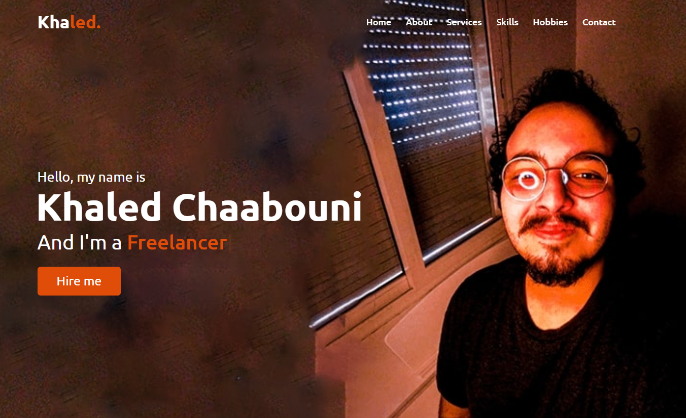

# Khaled Chaabouni's Portfolio

Welcome to my personal portfolio repository! This repository contains the source code and assets for my portfolio website. It showcases my skills, projects, and experiences. The website is built using HTML, CSS, and JavaScript and is designed to provide an overview of my work and background.

## Table of Contents

- [Demo](#demo)
- [Technologies Used](#technologies-used)
- [Sections](#sections)
- [Setup and Usage](#setup-and-usage)
- [Download CV](#download-cv)
- [License](#license)

## Demo

You can visit my live portfolio website by clicking [here](https://khaled-chaabouni.github.io/Portfolio/).

## Technologies Used

- HTML
- CSS
- JavaScript

## Sections

The portfolio website consists of the following sections:

- **Home:** This is the landing page of the website.
- **About:** Provides information about myself, my background, and my achievements.
- **Services:** Highlights the services I offer or the areas I specialize in.
- **Skills:** Showcases my skills and areas of expertise.
- **Hobbies:** Shares my hobbies and interests outside of work.
- **Contact:** Provides a form and contact details to get in touch with me.

The homepage includes a **Hire Me** button that directs visitors to the Contact section to inquire about my services or discuss potential opportunities.

## Setup and Usage

1. Clone the repository:

  >git clone https://github.com/Khaled-Chaabouni/Portfolio.git

2. Navigate to the project directory:

  >cd Portfolio

3. Open the index.html file in a web browser.

4. Customize the content:

  - Open the index.html file and modify the text, images, and links to match your own information.
  - Update the CSS styles in the styles.css file to customize the appearance of your website.
  - Add your projects, experiences, and any additional sections as needed.

5. Replace the demo images:

  - Replace the demo image files in the img directory with your own project screenshots or personal photos.

6. Deploy the website:

  - Upload the entire project directory to a web server or hosting platform of your choice.
  - Make sure the main page is named index.html for it to be served as the default landing page.

##Download CV

You can download my CV in PDF format by clicking the Download CV button on the About Me section of my portfolio website.

##License

This project is licensed under the MIT License.
